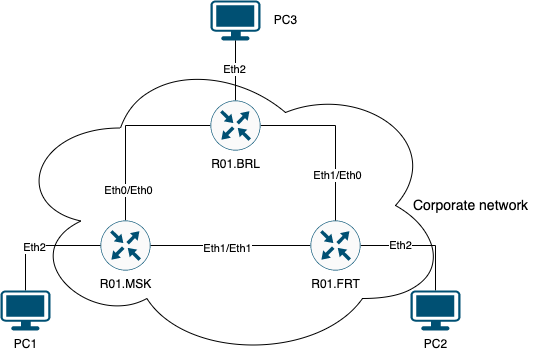

## Лабораторная работ №2 "Эмуляция распределенной корпоративной сети связи, настройка статической маршрутизации между филиалами"

### Описание

В данной лабораторной работе вы первый раз познакомитесь с компанией "RogaIKopita Games" LLC которая занимается разработкой мобильных игр с офисами в Москве, Франкфурте и Берлине. 
Для обеспечения работы своих офисов "RogaIKopita Games" вам как сетевому инженеру необходимо установить 3 роутера, назначить на них IP адресацию и поднять статическую маршрутизацию. 
В результате работы сотрудник из Москвы должен иметь возможность обмениваться данными с сотрудником из Франкфурта или Берлина и наоборот.

### Цель работы

Ознакомиться с принципами планирования IP адресов, настройке статической маршрутизации и сетевыми функциями устройств.

### Правила по оформлению

Правила по оформлению отчета по лабораторной работе вы можете изучить по [ссылке](../reportdesign.md)

### Ход работы

Основная часть лабораторной работы:

- Вам необходимо сделать сеть связи  в трех геораспределенных офисах "RogaIKopita Games" изображенную на рисунке 1 в ContainerLab. Необходимо создать все устройства указанные на схеме и соединения между ними.
  
> Напоминаю, что более подробно работу с СontainerLab можно изучить по [ссылке](https://containerlab.dev/quickstart/). 

Рисунок 1 - Схема связи трех геораспределенных офисов "RogaIKopita Games"

- Помимо этого вам необходимо настроить IP адреса на интерфейсах.
- Создать DHCP сервера на роутерах в сторону клиентских устройств.
- Настроить статическую маршрутизацию.
- Настроить имена устройств, сменить логины и пароли.

### В результате данной работы у вас должно быть:

- Файл который вы использовали для развертывания тестовой сети с расширением `.yaml`
- схема связи нарисованная вами в [draw.io](https://app.diagrams.net) или Visio.
- Текст ваших конфигураций для каждого сетевого устройства
- Результаты пингов, проверки локальной связности.