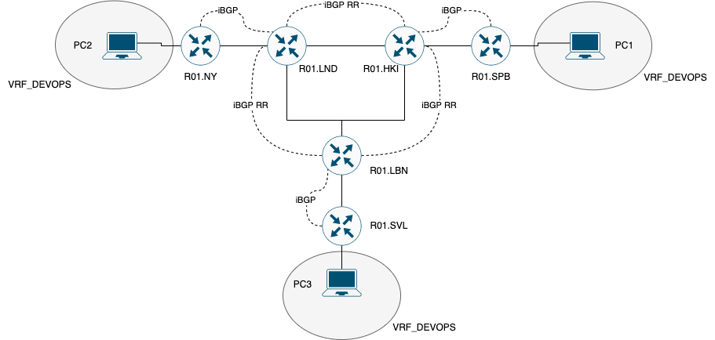

## Лабораторная работ №4 "Эмуляция распределенной корпоративной сети связи, настройка iBGP, организация L3VPN, VPLS"

### Описание

Компания "RogaIKopita Games" выпустила игру "Allmoney Impact", нагрузка на арендные сервера возрасли и вам поставлена задача стать LIR и организовать свою AS чтобы перенести все сервера игры на свою инфраструктуру. 
После организации вашей AS коллеги из отдела DEVOPS попросили вас сделать L3VPN между 3 офисами для служебных нужд. (Рисунок 1)
Данный L3VPN проработал пару недель и коллеги из отдела DEVOPS попросили вас сделать VPLS для служебных нужд.

### Цель работы
Изучить протоколы BGP, MPLS и правила организации L3VPN и VPLS.

### Правила по оформлению

Правила по оформлению отчета по лабораторной работе вы можете изучить по [ссылке](../reportdesign.md)

### Ход работы

- Вам необходимо сделать IP/MPLS сеть связи для "RogaIKopita Games" изображенную на рисунке 1 в ContainerLab. Необходимо создать все устройства указанные на схеме и соединения между ними.
  
> Напоминаю, что более подробно работу с СontainerLab можно изучить по [ссылке](https://containerlab.dev/quickstart/). 

Рисунок 1 - Схема связи IP/MPLS сети компании "RogaIKopita Games" с внедренным BGPv4

- Помимо этого вам необходимо настроить IP адреса на интерфейсах.
- Настроить OSPF и MPLS.
- Настроить iBGP с route reflector кластером

И вот тут лабораторная работа работа разделяется на 2 части, в первой части вам надо настроить L3VPN, во второй настроить VPLS, но при этом **менять топологию не требуется**. 
Вы можете просто разобрать VRF и на их месте собрать VPLS.

Первая часть:

- Настроить iBGP RR Cluster.
- Настроить VRF на 3 роутерах.
- Настроить RD и RT на 3 роутерах.
- Настроить IP адреса в VRF.
- Проверить связность между VRF
- Настроить имена устройств, сменить логины и пароли.

Вторая часть:

- Разобрать VRF на 3 роутерах (или отвязать их от интерфейсов).
- Настроить VPLS на 3 роутерах.
- Настроить IP адресацию на PC1,2,3 в одной сети.
- Проверить связность.

### В результате данной работы у вас должно быть:

- Файл который вы использовали для развертывания тестовой сети с расширением `.yaml`
- Cхема связи нарисованная вами в [draw.io](https://app.diagrams.net) или Visio.
- Текст ваших конфигураций для каждого сетевого устройства.
- Выкладки с маршрутами на каждом устройстве.
- Результаты пингов, проверки локальной связности.